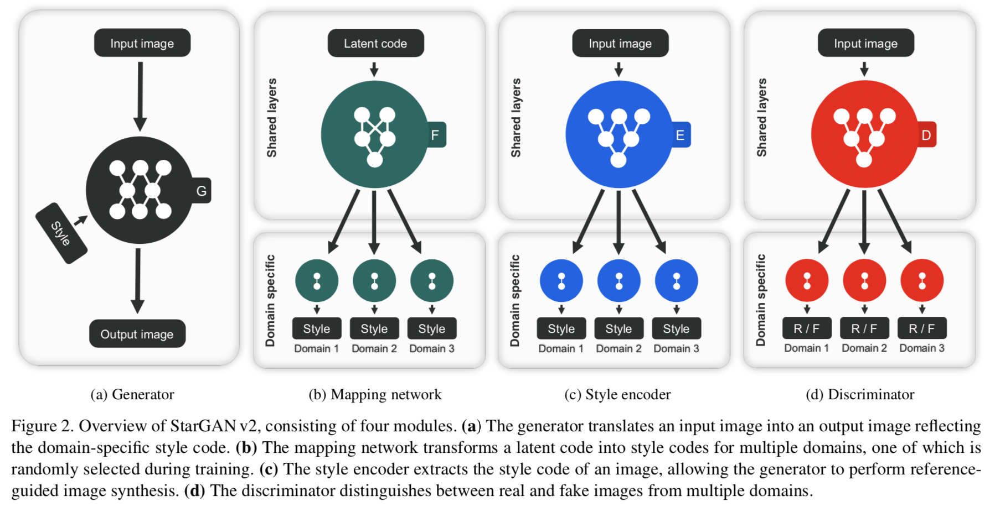
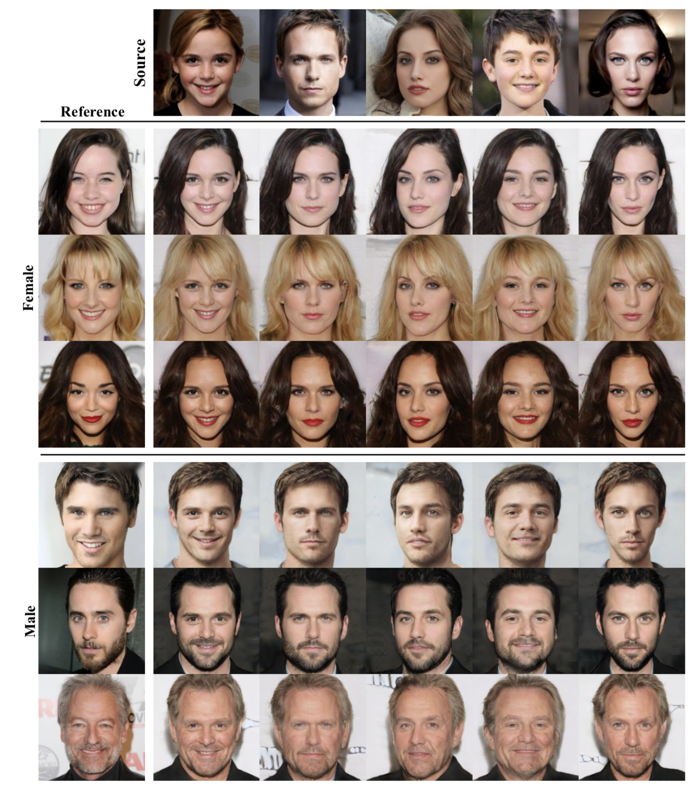

# starGAN v2 Pytorch Implementation

## Paper

[StarGAN v2: Diverse Image Synthesis for Multiple Domains](https://arxiv.org/abs/1912.01865)

## Now on dev and training.. 

## starGAN v2

- Model Architecture

- Results

